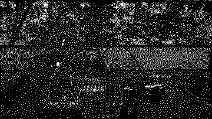

# population crowth

Logistic map for monome crow.

The dynamical system $x_n=rx_{x−1}(1−x_{−1})$ known as the logistic map. It oscillates between two points when $3 \leq r \leq 3.44949$, four and more points when $3.44949 \leq r \leq 3.56995$ and is chaotic when $3.56995 \lt r \lt 4$.

The function is a real classic in study of systems, and connected to early climate research and populations (of corvids too). I believe that is something crow people can appreciate. From [Wikipedia](https://en.wikipedia.org/wiki/Logistic_map):

> The map was initially utilized by Edward Lorenz in the 1960s to showcase properties of irregular solutions in climate systems. It was popularized in a 1976 paper by the biologist Robert May in part as a discrete-time demographic model analogous to the logistic equation written down by Pierre François Verhulst.

This script exposes the interesting range of $r$ from 3 to 4, set via crow <kbd>input 2</kbd>. There are two versions of the script, `population-crowth.lua` and `population-crowth-pp.lua`. The former is a more normal version. The latter is an extended version where $r$ is exposed to patch programming.

## Documentation

This is a druid script, ie. a script running directly on crow and not on norns. Run or upload to crow with [druid](https://monome.org/docs/crow/druid/), or use [bowering](https://llllllll.co/t/bowering-a-crow-script-loader-for-norns/71797) from norns as I do.

### The more straightforward version

In file `population-crowth.lua`

    → 1 clock
    → 2 r
      1 value t      →
      2 value t_{-1} →
      3 value t_{-2} →
      4 value t_{-3} →

Give clock to crow <kbd>input 1</kbd>, and set $r$ with <kbd>input 2</kbd>. <kbd>Output 1</kbd> is the current value of the logistic map, and the three older values cascade from output 1 towards 4 before falling off, kind of like a shift register.

### The patch programmable version

In file `population-crowth-pp.lua` you will find an extended, patch-programmable version of the logistic map. It implements the function $x_n=r \Delta(x_{x−1}) (1−\Delta(x_{−1}))$, where $\Delta$ is your Eurorack system.

    → 1 t_{-1}
    → 2 r
      1 t_{-1}       →
      2 value t_     →
      3 value t_{-1} →
      4 value t_{-2} →

Self-patch <kbd>output1</kbd> to <kbd>input 1</kbd>. Set $r$ with <kbd>input 2</kbd>. <kbd>Output 2</kbd> is the current value of the logistic map, and the two older values cascade from output 2 towards 4 before falling off, kind of like a shift register. If you patch output 1 directly to input 1, it will essentially have no effect (besides some noise and lower resolution) and it's the familiar logistic map. But in this version you can route the current value of the function $t_{-1}$ via slew limiters, attenuverters, sequencers, offsets, filters, CV recorders, granular processing, &c. 

This version runs at 137 BPM, a tempo I like for techno music. You can change it by [setting `clock.tempo` from druid](https://monome.org/docs/crow/reference/#tempo-and-timing) or `clock.clock.tempo` from norns, and there is a clock divider public variable `public.clockdiv` you can set.

There are a few [public variables](https://monome.org/docs/crow/reference/#public) if you are into that sort of thing. [bowering](https://llllllll.co/t/bowering-a-crow-script-loader-for-norns/71797) visualizes then.

Inspired really by [KlangauKöln’s *Logistic Equation* module](https://xn--klangbaukln-zfb.de/2022/12/03/logistic-equation-and-cv-triggerdelay/). Also thank you [Wikipedia](https://en.wikipedia.org/wiki/Logistic_map).

